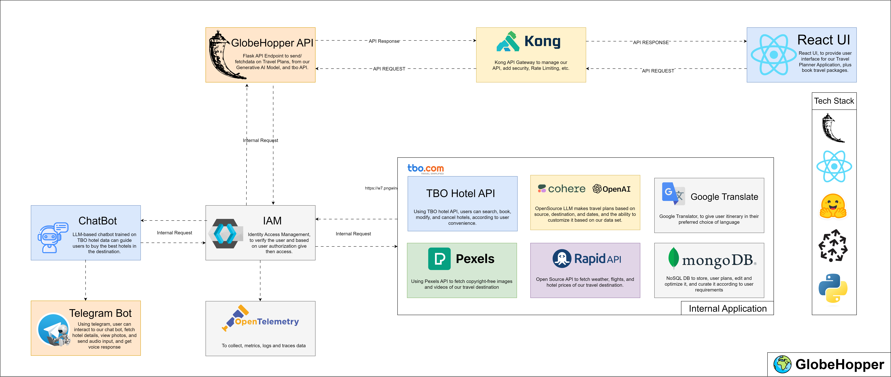

<h1 align="center">GlobeHopper</h1>

### PROBLEM STATEMENT

In the realm of travel planning, the process of <b>curating packages, crafting itineraries, and making informed decisions</b> about the <b>best times for travel and economical transportation</b> options can be <b>intricate and time-consuming.</b> 

The existing challenges in the travel industry <b>need to include the need for quicker, more efficient solutions</b> that <b>enhance the overall experience for travelers,</b> ensuring they <b>receive personalized, cost-effective, and well-planned journeys.</b>

## Package Builder & Dynamic Itinerary Generator 
- Take input as User preferences.
- Customized map plan with given dates.
- Real-time market trends.
- Curate personalized travel packages using GenAI.
- Budget constraints.
- Weather conditions.
- Local events.
- Suggest the Best time to travel.
- Modify itineraries, and the AI will adjust recommendations accordingly.


### SOLUTION

<p> We’ve designed a Flask backend & React frontend-based client-server architecture to develop a website with state-of-the-art Generative AI technology to prompt the Large Language Model to make API calls to give outputs based on user inputs to customize trip plans. 
</p>


## 1. Project Architecture

<p align="center">
  
</p> 

## 2. Getting Started With The Flask API Application

```sh
$ git clone https://github.com/IntelegixLabs/GlobeHopper.git
$ cd GlobeHopper
$ pip install -r requirements.txt
$ python app.py
```
### To run this project with docker locally
```sh
$ git clone https://github.com/IntelegixLabs/GlobeHopper.git
$ cd GlobeHopper
$ docker-compose -f docker/globehopper/docker-compose.yml up -d --build
```
Note: make sure you have secrets in the root folder

## 3. Getting Started With React UI Application

```sh
$ git clone https://github.com/IntelegixLabs/GlobeHopperUI.git
$ cd GlobeHopperUI
$ npm i
$ npm run dev
```

## 4. Project Requirements

<h4>Languages</h4>
<ul>
  <li>JavaScript</li>
  <li>Python 3.10.5</li>
</ul>

<h4>Frameworks</h4>
<ul>
  <li>Node v18.13.0</li>
  <li>Flask v2.3.2</li>
  <li>npm v8.11.0</li>
</ul>

## 5. Application Screenshots / <a href="">Demo.</a>

<p align="center">
  
  <hr/>
</p>


## 6. Components built 
* [x] Building Phase Started
