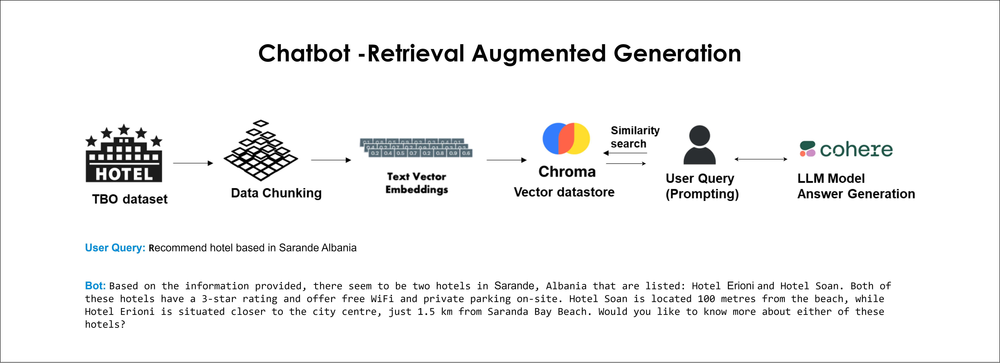
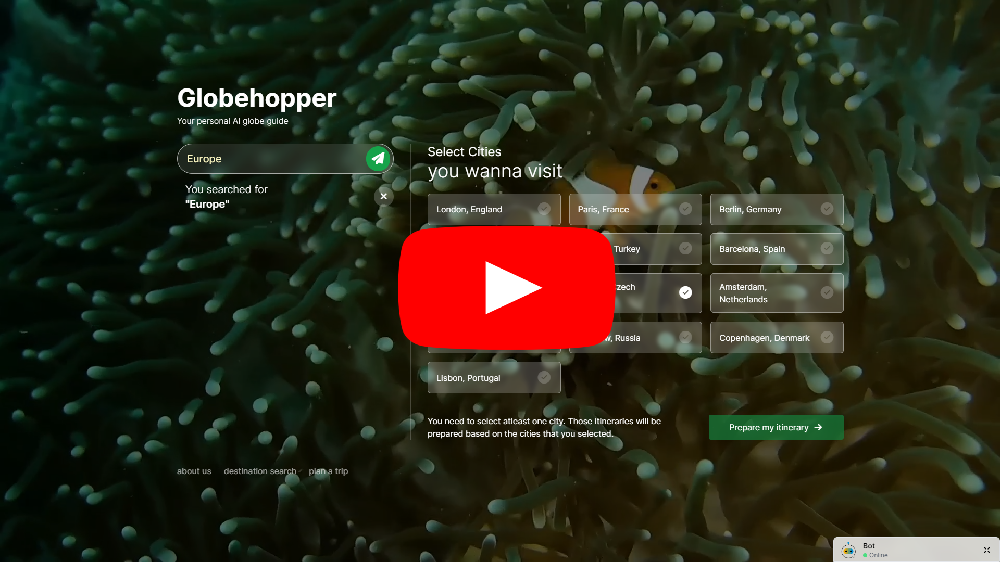
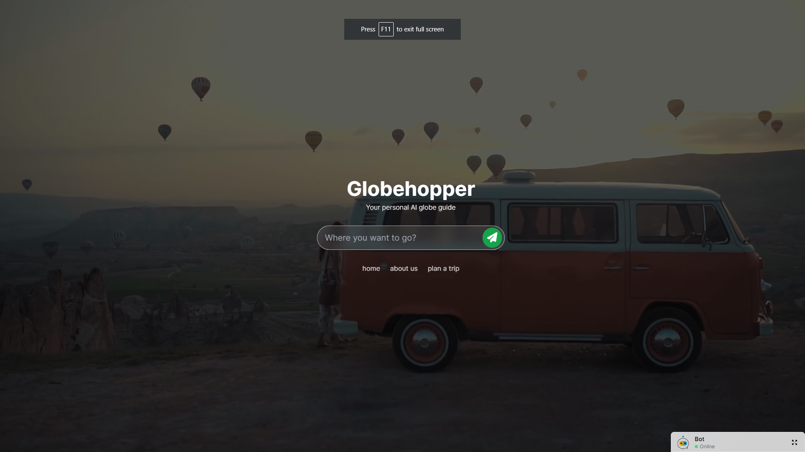
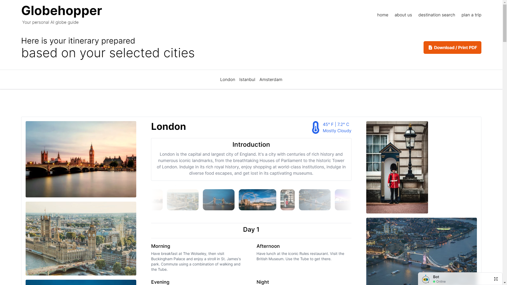
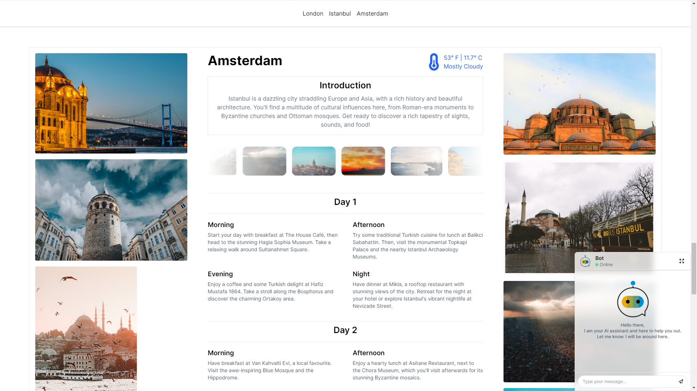
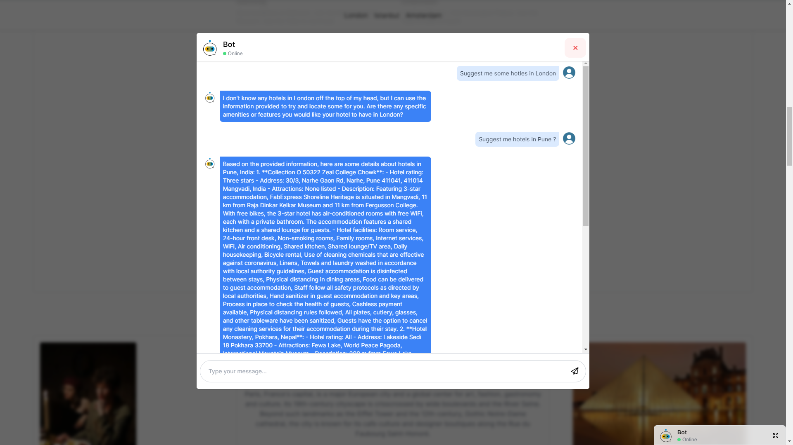
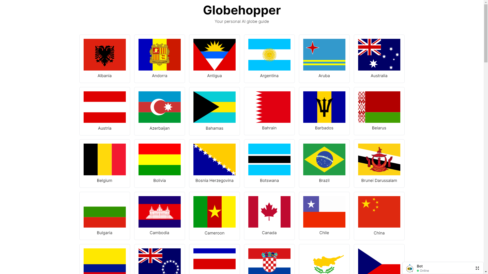
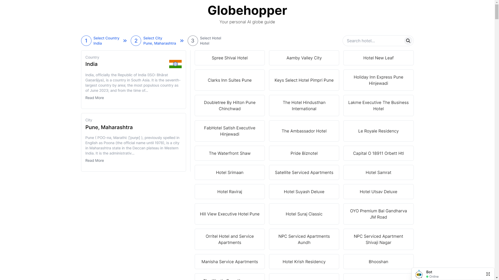

<h1 align="center">GlobeHopper</h1>

### PROBLEM STATEMENT

In the realm of travel planning, the process of <b>curating packages, crafting itineraries, and making informed decisions</b> about the <b>best times for travel and economical transportation</b> options can be <b>intricate and time-consuming.</b> 

The existing challenges in the travel industry <b>need to include the need for quicker, more efficient solutions</b> that <b>enhance the overall experience for travelers,</b> ensuring they <b>receive personalized, cost-effective, and well-planned journeys.</b>

## Package Builder & Dynamic Itinerary Generator

- Take customise input as user preferences.
- Select your destination, i.e. Europe -> and then select the cities you want to travel to, our Gen AI App, will create a travel 
  itinerary for you that you can customize according to your needs.
- Multi Lingual support, enables the user to get the travel itinerary in their preferred language.
- Customized map/direction from source to destination.
- Curate personalized travel packages using GenAI.
- Weather conditions.
- Some Iconic images/video of the place you want to travel.
- Suggest the Best time to travel.
- Modify itineraries, and the AI will adjust recommendations accordingly.
- Book hotels, using TBO APIs.

## Chat Bot Functionality

- Chatbot, trained on TBO hotels data.
- Based on hotel input get hotel details. eg Hotel Name, Facilities, Contact, Address etc.
- Integration with Telegram Chat Bot.
- Voice Functionality to enable user to ask a question via audio and get output in audio.

## TBO Hotel Booking

- User can search and book hotels from UI using TBO Hotel Booking API.


### SOLUTION

<p> We’ve designed a Flask backend & React frontend-based client-server architecture to develop a website with state-of-the-art Generative AI technology to prompt the Large Language Model to make API calls to give outputs based on user inputs to customize trip plans. 
</p>


## 1. Project Architecture

<p align="center">
  
</p> 

## 2. Chatbot Generative AI RAG (Retrieval Augment Generation) Architecture

<p align="center">
  
</p> 

## 3. Getting Started With The Flask API Application

```sh
$ git clone https://github.com/IntelegixLabs/GlobeHopper.git
$ cd GlobeHopper
$ pip install -r requirements.txt
$ python app.py
```

Note: Add the keys in .env file

### Delete the current db/chroma_db folder inside root directory and then download the chroma_db.zip and chroma_db_image.zip from the given url and extract and copy the chroma_db and chroma_db folder in db folder

```sh
$ cd db 
$ rm chroma_db
$ wget https://drive.google.com/file/d/1cajdpavDIFgMFwpi2nrn9j7mxvaxzBou/view?usp=sharing
$ unzip chroma_db.zip
$ wget https://drive.google.com/file/d/1EAKpgr6XQirFK39NvSxAP0_aoo4XP9AZ/view?usp=sharing
$ unzip chroma_db_image.zip
```

### To run this project with docker locally
```sh
$ git clone https://github.com/IntelegixLabs/GlobeHopper.git
$ cd GlobeHopper
$ docker-compose -f docker/globehopper/docker-compose.yml up -d --build
```
Note: make sure you have secrets in the root folder

## 4. Getting Started With React UI Application

```sh
$ git clone https://github.com/IntelegixLabs/GlobeHopperUI.git
$ cd GlobeHopperUI
$ npm i
$ npm run dev
```

Note: Add the keys in .env file

## 5. Project Requirements

<h4>Languages</h4>
<ul>
  <li>JavaScript</li>
  <li>Python 3.10.5</li>
</ul>

<h4>Frameworks</h4>
<ul>
  <li>Node v18.13.0</li>
  <li>Flask v2.3.2</li>
  <li>npm v8.11.0</li>
</ul>

## 6. Application Screenshots / <a href="">Demo.</a>

<p align="center">
  <a href="https://www.youtube.com/watch?v=h-emDPVAuCE"></a>
</p>

<br />
<hr />
<br />

<p align="center">
  
  
  
  
  
  
</p>


## 6. Components to be built (Work In Progress)

* [x] UI improvement.
* [x] TBO Flight Integration.
* [x] Enhancing performance improvements in Gen AI.
